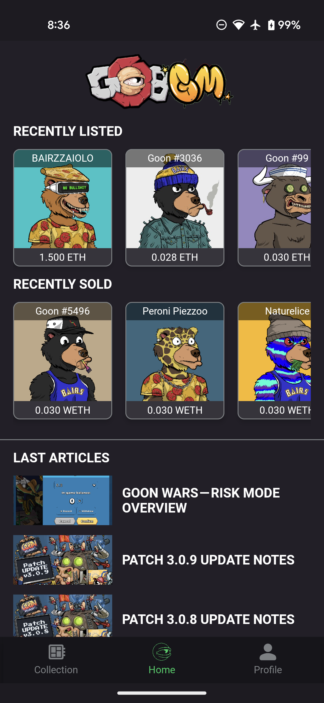
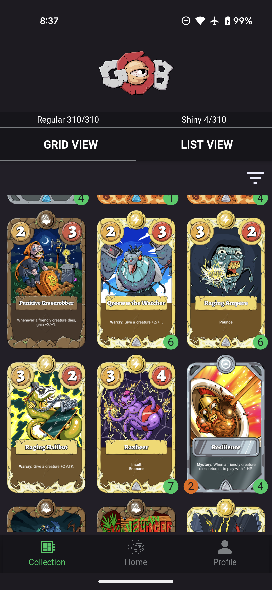

# Goon Wars TCG Companion

## Description
Goon Wars TCG Companion is an Android application designed for fans of the trading card game "Goons of Balatroon". With this app, players can easily track their card collection and stay updated on the latest market trends related to the game.

Key features include:
- **Collection Tracking:** Users can add their public address to the app and effortlessly track their card collection.
- **Market Insights:** Stay informed about the latest Goons listed on OpenSea and recent sales to make informed decisions about your collection.
- **Community Contribution:** The app's code is open-source, welcoming contributions from the community to improve and expand its features.

## Screenshots

  &nbsp;
  &nbsp;

  &nbsp;
  &nbsp;

  &nbsp;
  &nbsp;

## Want to Contribute?
We welcome contributions from developers and UX/UI designers interested in making Goon Wars TCG Companion even better! Whether you're passionate about refining the app's functionality or enhancing its visual appeal, we'd love to collaborate with you.

If you're a:
- **Developer:** Feel free to fork the repository and submit pull requests with your enhancements or bug fixes.
- **UX/UI Designer:** Help us give the app a fresh and intuitive look & feel. Your designs could greatly enhance the user experience.

## Appreciation and Support
Thank you for considering contributing to Goon Wars TCG Companion! Your support means a lot to us. If you'd like to show your appreciation, you can send contributions to the following wallet address: 
<b>0xf66BDf231C42aC74AD3A5a16900B54C69e5D7b53<b/>
